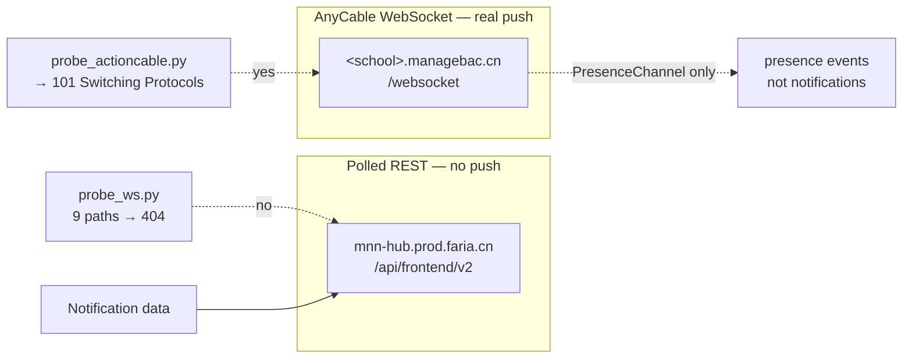

# Real-time notifications: what the transport can actually do

Written 2026-09-19. Every claim below was measured against a live `.cn`
account with the probes in `extras/`. No password was used and no state was
written. The school subdomain is deliberately not named here, since this file
ships in the sdist.

## The question

Can tahuti deliver ManageBac notifications in true real time — pushed the moment
a teacher posts a task — or is it limited to polling?

## Answer

**Polling is not the only option, but the thing that pushes is not the MNN hub.**
Two separate services are involved and they behave completely differently:



The ManageBac socket is real, but it carries presence — see below.

## What the MNN hub is

Polled REST, and only that. Measured:

| Probe | Result |
|---|---|
| WebSocket upgrade, 9 paths (`/cable`, `/ws`, `/socket`, …) | all `404` |
| SSE, 4 paths (`/events`, `/stream`, `/notifications/stream`, `/notifications/live`) | all `404`, `text/html` |
| Long-poll, 4 candidates | all answered in <0.1s — no blocking |
| Cable code in the `MnnHub.es-*.js` module and its 3 chunks | **zero occurrences** of `createConsumer`, `ActionCable`, `WebSocket`, `EventSource` |

The one `setInterval` in those chunks is a React "Thinking…" spinner, not a
poller. The notification bell in the browser is fed by ordinary fetches.

So the hub cannot push. But it has two properties that make polling cheap:

**Round-trip is fast.** 20 un-jittered requests to `/notifications/stats`:

```
min 71.1 ms   median 75.1 ms   mean 76.7 ms   max 92.4 ms
```

**Conditional requests work — on both endpoints.** This is the important one:

```
GET /notifications/stats  -> 200, Etag W/"14e0955c…", 32 bytes
GET … If-None-Match: that -> 304, 0 bytes
GET /notifications        -> 200, 90774 bytes
GET … If-None-Match: that -> 304, 0 bytes
```

A poll that costs 90 KB today costs **zero bytes** when nothing changed. That
removes the normal objection to tight polling.

## The blocker in the current code

`MNNHubClient._jitter()` sleeps a uniform 1–3 s on *every* call
(`src/tahuti/notifications.py:37-38`):

```python
def _jitter(self) -> None:
    time.sleep(random.uniform(1.0, 3.0))
```

The transport answers in **75 ms**. The jitter costs **1000–3000 ms**. Measured
over 20 requests: 1.5 s of network time versus 40 s with jitter — the jitter is
**26× the cost of the transport itself**, and it is the single largest latency
term in the whole design.

It is applied to exactly the two read methods, `stats()` and `list()`
(`notifications.py:43` and `:58`). Every mutating method — `mark_read`,
`mark_unread`, `mark_all_read`, `star`, `unstar` — is *not* jittered. So the
sleep is backwards from what a rate-limit defence would want: it slows the cheap
polls that need to be fast, and leaves the state-changing writes unslowed.

That also means the jitter caps the useful poll frequency of the cheap endpoint
at one request per 1–3 s. Any real-time design has to stop sleeping between the
*poll* and the *act*: poll on a timer, and pace by the timer rather than by a
random sleep inside each call.

There are no rate-limit headers (`X-RateLimit-*`, `Retry-After` absent), so the
API does not tell us its ceiling and the jitter is not demonstrably required.

## What ManageBac's own host does

`<school>.managebac.cn` runs **AnyCable** and accepts a real WebSocket:

```
GET /websocket HTTP/1.1
-> HTTP/1.1 101 Switching Protocols
   X-AnyCable-Version: 1.0.5-2b1cbd6
   Sec-WebSocket-Accept: PMb/FYNJ8nkYKnh751JWzKUjBcY=

then, unprompted:
{"type":"welcome","sid":"H94pV0EPK-bYNiovu1O5v"}
{"type":"ping","message":1789752829}      # every 3 s
```

It speaks the ActionCable protocol — the `@rails/actioncable` library is bundled
in `student-*.js`.

**Guessing produced no notification channel.** Six plausible names
(`NotificationsChannel`, `MnnHubChannel`, `NotificationChannel`,
`MessagesAndNotificationsChannel`, `NoticesChannel`,
`UnreadNotificationsChannel`) all got *silence* — no confirm, no reject.

Silence is a real negative here, established by control:

| Channel | Result |
|---|---|
| `ProgressChannel` | **`confirm_subscription`** |
| `PresenceChannel` | **`confirm_subscription`** |
| `Chat::RoomChannel` | **`reject_subscription`** (exists, not authorised) |
| `ZZZDefinitelyNotARealChannelQQQ` | silence — no confirm, no reject |

So the controls prove the frame encoding is correct and that AnyCable *rejects*
channels it knows but will not authorise, while answering unknown names with
silence. A confirmed control plus silent guesses means **those names do not
exist** — not that the probe failed.

The `ProgressChannel`/`PresenceChannel`/`PresentationChannel`/`CoreUnitChannel`/
`AttendanceReportsChannel` names come from the same bundle, which tells us the
frontend does use this socket for live updates — just not for the notification
bell, which the MNN hub module serves by fetch. The capture below confirms
which of those the bell actually relies on.

## Settled: the socket carries presence, not notifications

The missing `identifier` arrived — a DevTools WS capture from the notifications
page, with the socket open and the bell on screen. The whole session subscribes
to exactly one channel:

```json
{"channel":"PresenceChannel"}
```

Every frame after `welcome` is either that subscription confirming, or:

```json
{"type":"ping","message":1789787340}                        # every 3 s
{"identifier":"{\"channel\":\"PresenceChannel\"}", …,
 "message":{"event":"user-presence-changed","status":"online",
            "type":"presence","user_id":13243591}}
```

The handshake matches the probe byte for byte — `101`, `X-AnyCable-Version:
1.0.5-2b1cbd6`, `Sec-WebSocket-Protocol: actioncable-v1-json` — so this is
definitely the same socket `probe_actioncable.py` was talking to, and
`PresenceChannel` was one of its *controls*, which confirmed.

**But that capture cannot carry the argument on its own.** A passive capture
only shows channels that fired. The other seven channels are triggered by pages
and conditions that an idle notifications tab never reaches, so their absence
there is not evidence of anything. What settles it is reading the bundles.

### Every channel the frontend can open

All eight live in the one 950 KB student entry bundle; none is defined anywhere
else in the 8.9 MB closure. The socket URL comes from
`<meta name="action-cable-url" content="/websocket">`, present on every page.

| Channel | Subscription params | Inbound payload |
|---|---|---|
| `PresenceChannel` | — | `{user_id, status, type:"presence"}` |
| `PresentationChannel` | `id`, `ib_class_id`, `core_unit_id` | `type` ∈ `discussion`, `start_presentation`, `refresh_presentation_reactions`; no `type` = discussion reply |
| `CoreUnitChannel` | `id`, `ib_class_id` | `unit-section-pin`, `unit-remind-component-lock`, `container-update` |
| `Chat::RoomChannel` | `id` (room) | `event` ∈ `message-created`, `message-updated`, `message-deleted`, `user-muted`, `user-unmuted`, `room-info`, `error` |
| `Chat::StateChannel` | — | kebab `event` → `chat:<camelCased>` DOM event; explicit `messageSeen`, `userBanned`, `roomArchived`, … |
| `AssetPreviewsChannel` | `gid` | `{processing_status, url}` |
| `ProgressChannel` | `id` | `{percent, label}` |
| `AttendanceReportsChannel` | `uuid` | `{token, filename}` (teacher-only) |

What each is *for*, and why the capture missed it:

| Channel | Activated by | In a 2-min idle capture? |
|---|---|---|
| `PresenceChannel` | any page with `data-user-id`, gated by the activity detector | **yes — the only one** |
| `PresentationChannel` | `/student/classes/<c>/units/<u>/presentations` | no |
| `CoreUnitChannel` | a page carrying `data-cable-connection-name='CoreUnitChannel'` | no |
| `Chat::RoomChannel` / `Chat::StateChannel` | a mounted chat widget / Online Lesson room | no |
| `AssetPreviewsChannel` | a `data-gid` item entering the viewport | no |
| `ProgressChannel` | `data-controller="progress"` with an id value | no |
| `AttendanceReportsChannel` | `exportUuid`, teacher-only | no |

### No channel carries task, grade, or deadline data

The decisive check is absence across the whole 8.9 MB closure, not just the
channel code:

```
assignment_id  -> ABSENT      grade_letter -> ABSENT      due_date -> ABSENT
```

`task_id`/`task_title` appear in exactly one file, `mb-ui_AcademicAnalytics.*`,
which contains **zero** occurrences of `ActionCable`, `createConsumer`,
`WebSocket`, `subscriptions.create` or `EventSource` — it is pure REST chart
data. `grade` is an Atlas form field. `title`/`sender`/`body_preview` appear only
in the MNN-hub **REST** mapper. The `is_unread` badge in the student bundle is
the *chat* unread count, fed by `chat:roomUnreadUpdated`, not the bell.

The closest candidate is `PresentationChannel`, which does carry
author-attributed content — but `{author_id, action, id, discussion_id,
discussion_author_id}`, with no title, task, or grade, and on a `create` it
**fetches** the body over XHR rather than receiving it. That fetch-the-payload
pattern holds across all eight: the socket is a *trigger*, never the data.

### How the bell gets its data

A plain `fetch` to the hub's REST stats endpoint, on `turbolinks:load`, capped
at one call per 30 s via `sessionStorage`:

```js
onNotificationsStatsUpdated(w){ if(!w) return;
  window.tlManager?.inboxChanged?.(w);
  let E=w.unreadMessages, f=di(".notifications-count"), m=f.find("span.count");
  f.attr("data-count",E), m.html(E), m.toggleClass("d-none",E==0) }
```

```js
I=()=>(e,t)=>{ let{mnnHub:{endpoint:a,token:r}}=t();
  return y(a,r).get(p.statsNotifications()).json().then(({stats:n})=>n) … }
// statsNotifications: () => "notifications/stats"
```

`mb-ui_MnnHub.es-*.js` contains zero `setInterval`, zero `EventSource`, zero
`WebSocket`, zero `ActionCable`. The only gate is `statsCallTimeout: 3e4`, a
*minimum spacing* between fetches, not a poll interval — inside 30 s the cached
count is replayed instead of refetched.

One trap worth naming: the ActionCable `ConnectionMonitor` sets
`pollInterval={min:30,max:60,multiplier:5}`, which looks exactly like a
notification poller and is not — it is WebSocket liveness.

**ManageBac has no push channel for notifications.** The ceiling is a fast
conditional poll, and the design below is it.

## What is needed to finish this

Nothing further — the question is closed from two directions: the browser's own
subscription, and the bundle's complete channel inventory. If a future release
adds a notification channel, `extras/probe_actioncable.py` is the tool that
would find it: add the name to `CHANNELS` and the controls still calibrate
whether silence means anything. The static side is the part worth re-checking
after any frontend release, since a new channel would not show up in a passive
capture.

## Recommended design

Poll `/notifications/stats` with `If-None-Match` on a short timer. Fetch
`/notifications` in full only when the stats Etag changes.

| | today | proposed |
|---|---|---|
| Steady-state cost per poll | 90 KB + 1–3 s sleep | **0 bytes**, no sleep |
| Median latency to detect | ≥1 s, often 3 s | ~75 ms + timer interval |
| Full fetches | every poll | only when the count moves |

At a 5 s interval that is ~12 polls/min, 32 bytes each when idle. That is
genuinely near-real-time for a homework tracker, it uses only endpoints already
in the codebase, and it needs no new transport, dependency, or protocol.

It uses the same *transport* ManageBac's own frontend does — the hub's REST
stats endpoint, over fetch — so this is the supported path rather than a
workaround. It is not the same *cadence*, and tahuti would be strictly fresher:
ManageBac's bell refreshes on page navigation and then no more than once per
30 s, so a timer-based poll beats what ManageBac itself delivers. See "How the
bell gets its data" below.

Two changes make it real:

1. **Take `_jitter()` off the read path**, or make it opt-in and off by default.
   It currently sleeps 1–3 s inside `stats()` and `list()` and nowhere else,
   which is exactly inverted for a polling client. If pacing is wanted, do it in
   the daemon's scheduler, where the interval is already a setting, rather than
   inside the transport where it silently multiplies every call.
2. **Send `If-None-Match`** with the last Etag and treat `304` as "nothing
   changed".

The AnyCable socket stays out of the picture for notifications. It is a real
push channel — just not for anything that can drive a homework bell. On a
presentation page the student browser subscribes to `PresentationChannel` and
receives live discussion create/update/destroy and `start_presentation` events;
see the channel inventory below. Building on it would mean implementing
ActionCable framing to receive events ManageBac does not send for tasks.

## Probes

| File | What it establishes |
|---|---|
| `extras/probe_ws.py` | raw TLS WebSocket handshake; `requests` cannot do `ws://` |
| `extras/probe_actioncable.py` | ActionCable subscribe, with controls that calibrate what silence means |
| `extras/probe_latency.py` | the 75 ms floor and the 26× jitter cost |
| `extras/probe_frontend.py` | scans the real JS bundles for live-channel code |
| `extras/probe_push.py` | SSE / long-poll / rate-limit posture |

All are read-only, take the session cookie only, and assert
`MB_CRAWLER_CREDS_PATH` is set so they cannot reach real credentials.
