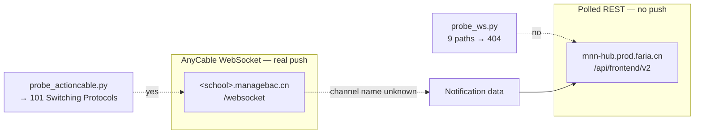

# Real-time notifications: what the transport can actually do

Written 2026-09-19. Every claim below was measured against the live account
(`myschool.managebac.cn`) with the probes in `extras/`. No password was used
and no state was written.

## The question

Can tahuti deliver ManageBac notifications in true real time — pushed the moment
a teacher posts a task — or is it limited to polling?

## Answer

**Polling is not the only option, but the thing that pushes is not the MNN hub.**
Two separate services are involved and they behave completely differently:



## What the MNN hub is

Polled REST, and only that. Measured:

| Probe | Result |
|---|---|
| WebSocket upgrade, 9 paths (`/cable`, `/ws`, `/socket`, …) | all `404` |
| SSE, 4 paths (`/events`, `/stream`, `/notifications/stream`, `/notifications/live`) | all `404`, `text/html` |
| Long-poll, 4 candidates | all answered in <0.1s — no blocking |
| Cable code in the `MnnHub.es-*.js` module and its 3 chunks | **zero occurrences** of `createConsumer`, `ActionCable`, `WebSocket`, `EventSource` |

The one `setInterval` in those chunks is a React "Thinking…" spinner, not a
poller. The notification bell in the browser is fed by ordinary fetches.

So the hub cannot push. But it has two properties that make polling cheap:

**Round-trip is fast.** 20 un-jittered requests to `/notifications/stats`:

```
min 71.1 ms   median 75.1 ms   mean 76.7 ms   max 92.4 ms
```

**Conditional requests work — on both endpoints.** This is the important one:

```
GET /notifications/stats  -> 200, Etag W/"14e0955c…", 32 bytes
GET … If-None-Match: that -> 304, 0 bytes
GET /notifications        -> 200, 90774 bytes
GET … If-None-Match: that -> 304, 0 bytes
```

A poll that costs 90 KB today costs **zero bytes** when nothing changed. That
removes the normal objection to tight polling.

## The blocker in the current code

`MNNHubClient._jitter()` sleeps a uniform 1–3 s on *every* call
(`src/mb_cli/notifications.py:37-38`):

```python
def _jitter(self) -> None:
    time.sleep(random.uniform(1.0, 3.0))
```

The transport answers in **75 ms**. The jitter costs **1000–3000 ms**. Measured
over 20 requests: 1.5 s of network time versus 40 s with jitter — the jitter is
**26× the cost of the transport itself**, and it is the single largest latency
term in the whole design.

It is applied to exactly the two read methods, `stats()` and `list()`
(`notifications.py:43` and `:58`). Every mutating method — `mark_read`,
`mark_unread`, `mark_all_read`, `star`, `unstar` — is *not* jittered. So the
sleep is backwards from what a rate-limit defence would want: it slows the cheap
polls that need to be fast, and leaves the state-changing writes unslowed.

That also means the jitter caps the useful poll frequency of the cheap endpoint
at one request per 1–3 s. Any real-time design has to stop sleeping between the
*poll* and the *act*: poll on a timer, and pace by the timer rather than by a
random sleep inside each call.

There are no rate-limit headers (`X-RateLimit-*`, `Retry-After` absent), so the
API does not tell us its ceiling and the jitter is not demonstrably required.

## What ManageBac's own host does

`<school>.managebac.cn` runs **AnyCable** and accepts a real WebSocket:

```
GET /websocket HTTP/1.1
-> HTTP/1.1 101 Switching Protocols
   X-AnyCable-Version: 1.0.5-2b1cbd6
   Sec-WebSocket-Accept: PMb/FYNJ8nkYKnh751JWzKUjBcY=

then, unprompted:
{"type":"welcome","sid":"H94pV0EPK-bYNiovu1O5v"}
{"type":"ping","message":1789752829}      # every 3 s
```

It speaks the ActionCable protocol — the `@rails/actioncable` library is bundled
in `student-*.js`.

**The channel name is the missing piece.** Guessing produced no notification
channel. Six plausible names (`NotificationsChannel`, `MnnHubChannel`,
`NotificationChannel`, `MessagesAndNotificationsChannel`, `NoticesChannel`,
`UnreadNotificationsChannel`) all got *silence* — no confirm, no reject.

Silence is a real negative here, established by control:

| Channel | Result |
|---|---|
| `ProgressChannel` | **`confirm_subscription`** |
| `PresenceChannel` | **`confirm_subscription`** |
| `Chat::RoomChannel` | **`reject_subscription`** (exists, not authorised) |
| `ZZZDefinitelyNotARealChannelQQQ` | silence — no confirm, no reject |

So the controls prove the frame encoding is correct and that AnyCable *rejects*
channels it knows but will not authorise, while answering unknown names with
silence. A confirmed control plus silent guesses means **those names do not
exist** — not that the probe failed.

The `ProgressChannel`/`PresenceChannel`/`PresentationChannel`/`CoreUnitChannel`/
`AttendanceReportsChannel` names come from the same bundle, which tells us the
frontend does use this socket for live updates. It just does not appear to use it
for the notification bell, which the MNN hub module serves by fetch.

## What is needed to finish this

One piece of browser evidence: with the notifications page open, filter the
Network tab to **WS** and read the `subscribe` frame's `identifier`. That names
the channel and settles whether push is reachable. Per the established
redaction rule, capture the `identifier` only — **never the `Authorization` or
JWT value**.

If the bell has no WS frame at all, it is fetch-polled and the honest answer is
that ManageBac has no push channel for notifications, and the design below is
the ceiling.

## Recommended design either way

Poll `/notifications/stats` with `If-None-Match` on a short timer. Fetch
`/notifications` in full only when the stats Etag changes.

| | today | proposed |
|---|---|---|
| Steady-state cost per poll | 90 KB + 1–3 s sleep | **0 bytes**, no sleep |
| Median latency to detect | ≥1 s, often 3 s | ~75 ms + timer interval |
| Full fetches | every poll | only when the count moves |

At a 5 s interval that is ~12 polls/min, 32 bytes each when idle. That is
genuinely near-real-time for a homework tracker, it uses only endpoints already
in the codebase, and it needs no new transport, dependency, or protocol.

Two changes make it real:

1. **Take `_jitter()` off the read path**, or make it opt-in and off by default.
   It currently sleeps 1–3 s inside `stats()` and `list()` and nowhere else,
   which is exactly inverted for a polling client. If pacing is wanted, do it in
   the daemon's scheduler, where the interval is already a setting, rather than
   inside the transport where it silently multiplies every call.
2. **Send `If-None-Match`** with the last Etag and treat `304` as "nothing
   changed".

Then the socket becomes an optional fast path if the WS frame ever turns up a
notification channel — not a dependency.

## Probes

| File | What it establishes |
|---|---|
| `extras/probe_ws.py` | raw TLS WebSocket handshake; `requests` cannot do `ws://` |
| `extras/probe_actioncable.py` | ActionCable subscribe, with controls that calibrate what silence means |
| `extras/probe_latency.py` | the 75 ms floor and the 26× jitter cost |
| `extras/probe_frontend.py` | scans the real JS bundles for live-channel code |
| `extras/probe_push.py` | SSE / long-poll / rate-limit posture |

All are read-only, take the session cookie only, and assert
`MB_CRAWLER_CREDS_PATH` is set so they cannot reach real credentials.
