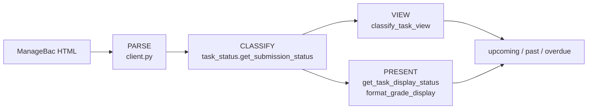

# Task classification: original vs current logic

Written 2026-09-19 to support a decision about whether the submission-parsing
change (merged onto `worktree-code-review-cleanup`) may alter what `tahuti list`
reports. **No code changes accompany this document.** It describes two
implementations side by side so the difference can be reviewed before anything
is altered.

The governing constraint: **classification output is frozen.** `[upcoming]`,
`[past]`, `[overdue]` and the per-task grade column must stay identical to the
original unless a specific change is approved.

"Original" means `main` (the `0.4.0` release). "Current" means the review branch,
which adds canonicalisation of ManageBac's submission wording.

---

## 1. The pipeline

Both versions share the same four stages. Only **Parse** and one line of
**Classify** differ.



Stages 3 and 4 are byte-identical between the two versions — confirmed by
inspection (`classify_task_view`, `is_task_todo`, `is_task_completed`,
`get_task_display_status`, `get_grade_status`, `format_grade_display` are
untouched) and by measurement (§5).

There are **two parse entry points**, and they are the reason the two versions
diverge where they do:

| Entry point | Page | Used by |
|---|---|---|
| `get_class_grades` → `get_class_tasks` | `/student/classes/<id>/core_tasks` | `tahuti list` for this account (all 9 classes discovered, so the tile page is never fetched) |
| `_parse_tile` | `/student/tasks_and_deadlines` | the tasks-list page; **not exercised by this account** |

---

## 2. Original logic

### 2.1 Parse — class-grades card

```
status_el = card.find("span", class matches /\b(submitted|not-submitted)\b/)
status     = status_el.text if status_el else None          # stored VERBATIM

if status is None:                        # only reached when no span matched
    if   "submitted"      in lower(labels): status = "submitted"
    elif "pending"        in lower(labels)
      or "not submitted"  in lower(labels): status = "not-submitted"

has_submit_btn = card has a link to /core_tasks/<id>/dropbox
              OR card has any <a>/<button> whose text contains
                 "submit", "submit coursework" or "upload submission"
```

Three properties matter:

1. The selector matches on the element's **class** and stores its **text**. The
   class says `not-submitted`; the text reads `Not Submitted`.
2. Nothing ever matches for the *submitted* case — no element on the page has a
   class containing `submitted`. Submitted is signalled only by a green badge
   whose label happens to read `Submitted`.
3. The labels fallback is **dead for exactly the tasks that need it**: when the
   span matched, `status` is truthy (`"Not Submitted"`), so the `if status is
   None` branch never runs.

### 2.2 Parse — tasks-list tile

```
parsed = { title, link, id, due_date, class_name,
           labels, grade_letter, grade_score, has_submit_button }
# NOTE: parsed carries no "status" key at this point.

sub_status = get_submission_status(parsed)        # classifies from labels + grade only

parsed["status"] = "submitted"     if sub_status == SUBMITTED
                   else              "not-submitted"        # ← unconditional
if sub_status == PENDING:
    parsed["has_submit_button"] = True              # synthesized, not read
```

The tile never reads a submission signal off the page. It asserts
`"not-submitted"` for **every task it cannot prove submitted**, including graded
ones, and then synthesizes the submit button from the state it just invented.

### 2.3 Classify — `get_submission_status` (original)

```
status = lower(strip(task["status"]))

if status == "submitted":                              return SUBMITTED
if any(is_submitted_badge(l) for l in labels + detail.labels): return SUBMITTED
if lower(detail["status"]) == "submitted":             return SUBMITTED
if detail.submission or detail.submissions:            return SUBMITTED
if is_submitted_badge(grade_score or grade_letter):    return SUBMITTED

has_submit_btn = task.has_submit_button or detail.has_submit_button
if status == "not-submitted" or has_submit_btn:        return PENDING

return NONE
```

**The load-bearing defect.** `status` has been lowercased but not otherwise
normalised, so a card that rendered `Not Submitted` arrives as `"not submitted"`
— space, not hyphen — and `status == "not-submitted"` is permanently false. The
`has_submit_btn` half of the `or` is what actually decides every real case.

### 2.4 Reconstruct — `get_class_tasks`

```
is_submitted     = is_task_submitted(t)
has_submit_btn   = t.has_submit_button

if   is_submitted:                                   task_status = "submitted"
elif has_submit_btn or t["status"] == "not-submitted": task_status = "not-submitted"
else:                                                task_status = t["status"]   # raw
```

The second arm compares the stored text against the hyphenated token, so it too
never fires on a class-grades card. In practice: `submitted` if the badge label
said so, else `not-submitted` if a submit control exists, else the raw page text.

### 2.5 Net effect, as pseudocode

```
submitted?  ⟸ badge label contains "Submitted"
pending?    ⟸ a submit control exists on the card        # the ONLY live signal
unknown?    ⟸ neither
```

The classification was correct on this account, but it was correct **because
every unsubmitted task happened to carry a submit control**, not because the
page's stated status was read.

---

## 3. Current logic

### 3.1 New: canonicalisation (`task_status.py`)

Two tokens exist and every producer stores one, every consumer tests one:

```
SUBMISSION_SUBMITTED     = "submitted"
SUBMISSION_NOT_SUBMITTED = "not-submitted"
```

```
normalize_submission_status(raw):
    words = lowercase(raw) split on non-letters
    if words is empty:                        return None
    if any word not in STATE_WORDS:           return None   # e.g. "Submit Coursework"
    if any word in SUBMIT_WORDS:                          # submit, submitted, submission…
        if any word in OUTSTANDING_WORDS or NEGATION_WORDS:
            return NOT_SUBMITTED                          # "Not Submitted", "No submission"
        return SUBMITTED
    if any word in OUTSTANDING_WORDS:        return NOT_SUBMITTED   # "Pending", "Waiting"
    return None
```

`STATE_WORDS` is a **whitelist**, which is what stops an *action* label
("Submit Coursework", "Upload submission") from being read as a *state*.
Returning `None` is a real answer and is never coerced into a state.

```
submission_status_from_labels(labels):
    tokens = [normalize(l) for l in labels]
    if SUBMITTED     in tokens: return SUBMITTED
    if NOT_SUBMITTED in tokens: return NOT_SUBMITTED
    return None                          # silence stays None
```

### 3.2 Parse — class-grades card (current)

```
status = _card_submission_status(card, labels)

_card_submission_status(card, labels):
    for el in card.find_all(class matches state-class regex):
        token = normalize(el.text);  if token: return token     # "Not Submitted" → not-submitted
    for el in card.find_all(class matches badge regex):
        token = normalize(el.text);  if token: return token     # reads the green badge's label
    return submission_status_from_labels(labels)                # None if the card is silent

has_submit_btn = UNCHANGED from the original
```

The submitted state is now actually read — from the badge's **label text**, never
its colour, since both the pending and submitted badges share the `badge` class.

### 3.3 Parse — tasks-list tile (current)

```
variant = f-task-score--<modifier> on the tile's score element   # or None if absent

declared = SUBMITTED     if variant == "submitted"
         = NOT_SUBMITTED if variant == "due"          # suffix falls back to the due date
         = None           if variant == "not-assessed" # deliberately NOT a submission state
         = None           if no modifier

if declared is None:
    declared = submission_status_from_labels(labels)

sub_status = get_submission_status(parsed)
if declared == SUBMITTED:                          sub_status = SUBMITTED
elif declared == NOT_SUBMITTED and sub_status != SUBMITTED:
                                                   sub_status = PENDING

parsed["status"] = SUBMITTED     if sub_status == SUBMITTED
                 = NOT_SUBMITTED if sub_status == PENDING
                 = None          otherwise        # ← only written when the tile says so

if sub_status == PENDING: parsed["has_submit_button"] = True
```

The unconditional `else "not-submitted"` is gone, and the variant is read instead
of the tile's (absent) submit control.

### 3.4 Classify — `get_submission_status` (current)

```
status = normalize_submission_status(task["status"])            # ← the one changed line

if status == SUBMITTED:                              return SUBMITTED
if any(is_submitted_badge(l) for l in labels + detail.labels): return SUBMITTED
if normalize(detail["status"]) == SUBMITTED:          return SUBMITTED
if detail.submission or detail.submissions:           return SUBMITTED
if is_submitted_badge(grade_score or grade_letter):   return SUBMITTED

has_submit_btn = task.has_submit_button or detail.has_submit_button
if status == NOT_SUBMITTED or has_submit_btn:        return PENDING

return NONE
```

Everything below the first line is structurally identical to the original. The
classifier normalises independently of the parse layer, so neither depends on
the other having done its job.

### 3.5 Reconstruct — `get_class_tasks` (current)

```
canonical_status = normalize(t["status"])

if   is_submitted:                                        task_status = "submitted"
elif has_submit_btn or canonical_status == NOT_SUBMITTED: task_status = "not-submitted"
else:                                                     task_status = canonical_status or t["status"]
```

### 3.6 Net effect, as pseudocode

```
submitted?  ⟸ badge label contains "Submitted"           (now read, was incidental)
pending?    ⟸ a submit control exists
          OR the page states an outstanding state         ← NEW, ungated
unknown?    ⟸ neither
```

---

## 4. What actually changed

| # | Site | Original | Current |
|---|---|---|---|
| 1 | `task_status.py` | — | `normalize_submission_status`, `submission_status_from_labels`, two tokens |
| 2 | `get_submission_status` | exact-string `== "not-submitted"` | normalises first |
| 3 | `get_class_grades` | inline regex + dead labels fallback, text stored verbatim | `_card_submission_status`, canonical token |
| 4 | `get_task_detail` | same inline pattern | `_card_submission_status` |
| 5 | `get_class_tasks` | `t["status"] == "not-submitted"` | `canonical_status == NOT_SUBMITTED` |
| 6 | `_parse_tile` | asserts `not-submitted` for anything unproven | reads `f-task-score--*` variant; writes `status` only when declared |
| 7 | `has_submit_btn` | dropbox link **or** submit-text control | **unchanged** — verified against `main` |

Unchanged and verified by inspection: `classify_task_view`, `is_task_todo`,
`is_task_completed`, `get_task_display_status`, `get_grade_status`,
`format_grade_display`, `is_task_submitted`, `align_timezones`, `as_naive`.

---

## 5. Measured effect on live data

All 45 task cards across the account's 9 class-grades pages, parsed with each
version and classified with the matching `task_status.py`:

| | Original | Current |
|---|---|---|
| upcoming | 11 | 11 |
| past | 33 | 33 |
| **overdue** | **1** | **1** |
| tasks whose view moved | — | **0** |
| tasks whose display string moved | — | **0** |

Overdue is `27521927 kinematics 1 quiz` (Sep 16, `⚠ Unsubmitted`,
`Incomplete (Todo)`) under both.

The only parsed field that differs at all is `status`, and only in spelling —
`'Not Submitted'` → `'not-submitted'` on 11 cards. `labels`, `has_submit_button`,
`grade_letter` and `grade_score` are identical on all 45.

**Why nothing moved:** all 11 of those cards carry a submit control, so both
versions of `get_class_tasks` take the same branch and emit the same
reconstructed `status`. `get_class_tasks` output differs in **zero fields**
across all 45 tasks.

One correction worth recording: an earlier scan reported that 13 unsubmitted
cards had no dropbox link. That was wrong — `has_submit_btn` also accepts any
link or button whose text contains "submit", and every one of those cards
carries `<a class="btn btn-primary" …>Submit Coursework</a>`. The only
genuinely submit-less unsubmitted cards are two, and both are graded, so both
are `past` either way.

---

## 6. The one latent divergence

Change #5 introduced a path the original could not take. In
`get_class_tasks` (current):

```
elif has_submit_btn or canonical_status == NOT_SUBMITTED:
```

The `canonical_status` arm is **not gated on `has_submit_btn`**. For a past-due
card that states `cell not-submitted` but carries *no* submit control and *no*
`Pending` label:

```
original:  status = "Not Submitted"  →  classify misses it  →  NONE  →  past
current:   status = "not-submitted"  →  PENDING             →  overdue
```

That is a `past` → `overdue` move on a task the page gives no way to submit —
precisely what the frozen-classification rule forbids. **No such card exists on
this account today**, so the risk is latent, not live. It is also in tension
with the new helper's own docstring, which insists that a card saying nothing
must stay `None`.

Candidate fix, if the freeze is to hold by design rather than by luck:

```
elif has_submit_btn:                      task_status = "not-submitted"
else:                                     task_status = t["status"]     # raw, as before
```

This reproduces the original exactly while keeping the canonical token available
in the parsed data for any future consumer.

---

## 7. Open questions

1. **The tasks-list/tile path is unverified against live markup.** Change #6
   moved it from 28 overdue to 11 on a synthetic mix, and this account never
   fetches that page. Fetching it needs a second login. Until then treat the
   tile path as untested, not as safe.
2. **Should the latent divergence in §6 be closed?** It changes nothing
   observable today and only prevents a future unapproved movement.
3. **Genuinely-unknown tasks.** Seven live tasks have no submission badge, no
   dropbox and no grade; they display `Complete` on the class path and, after
   change #6, `Complete` on the tile path too (they previously read
   `Incomplete (Todo)` there). Whether that should be `Complete`, an honest
   `Unknown`, or `Incomplete (Todo)` is undecided.
4. **`overdue` means "still actionable"** — the owner's proposed rule, not yet
   approved: past-due and still submittable, where a graded F stays overdue only
   if resubmittable. It depends on `has_submit_button` being trustworthy, which
   the tile path does not yet guarantee.
